

	
	&nbsp;&nbsp;&nbsp;&nbsp;&nbsp;&nbsp;&nbsp;&nbsp;
	
	<h2>Katapult — A simple grid launcher for Mudita Kompakt</h2>

> [!NOTE]
> To install, download the latest APK from [Releases](https://github.com/gezimos/Katapult/releases) and install it on your device using Mudita Center or ADB/webADB.

    <table>
        <tr>
            <td>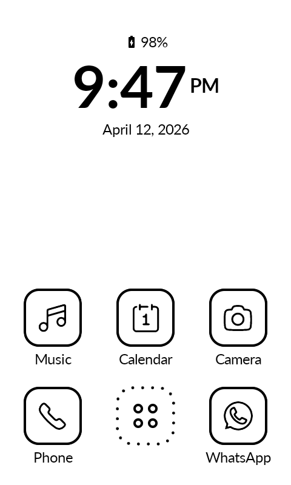</td>
            <td>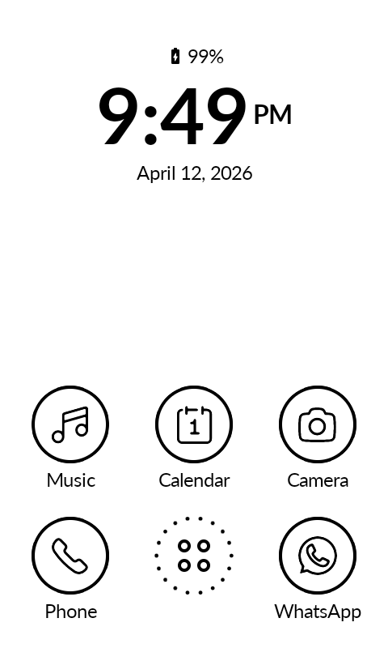</td>
            <td>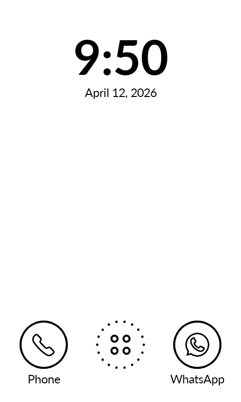</td>
            <td>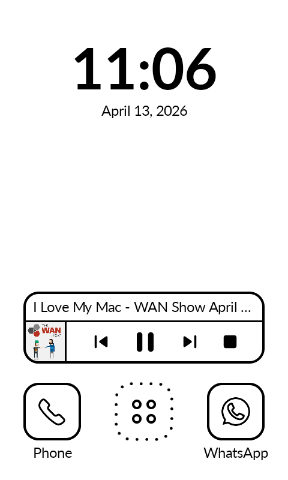</td>
        </tr>
        <tr>
            <td>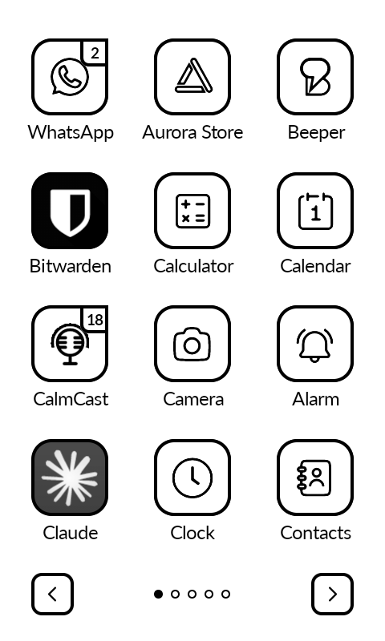</td>
            <td>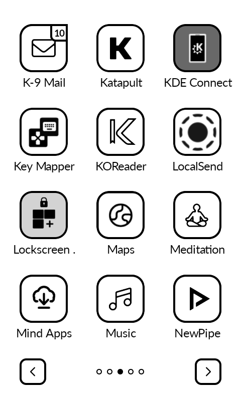</td>
            <td>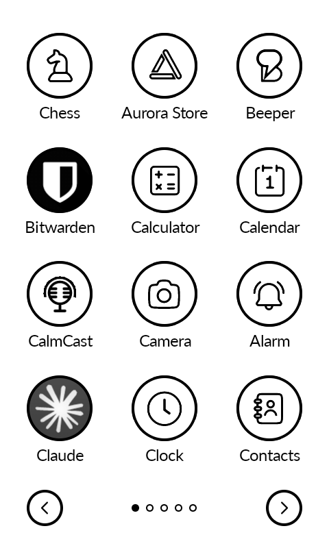</td>
            <td>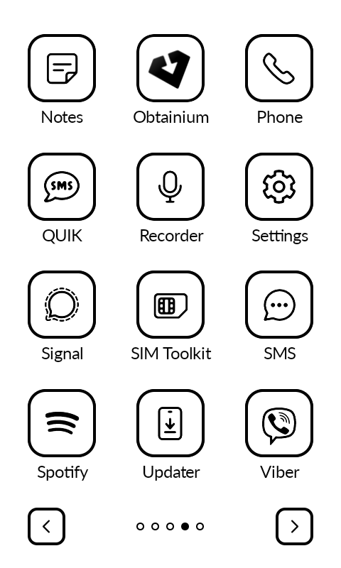</td>
        </tr>
        <tr>
            <td>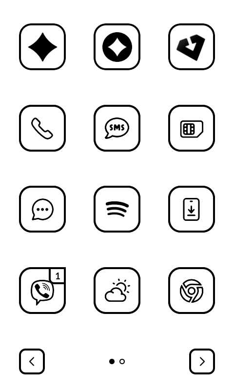</td>
            <td>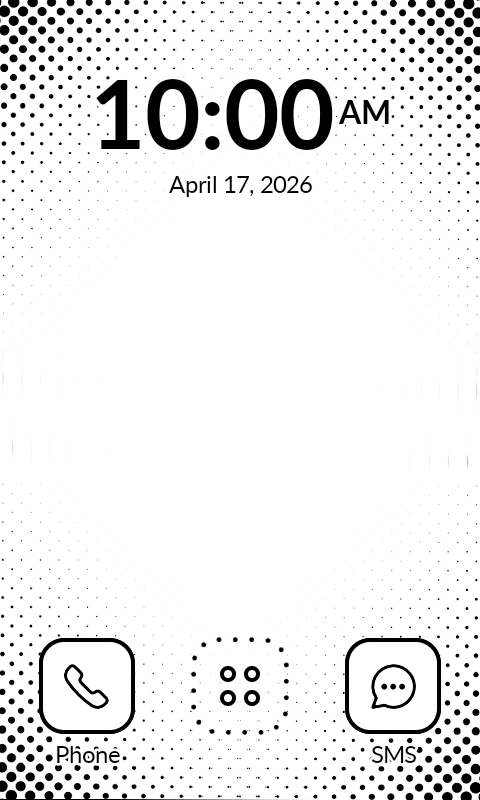</td>
            <td>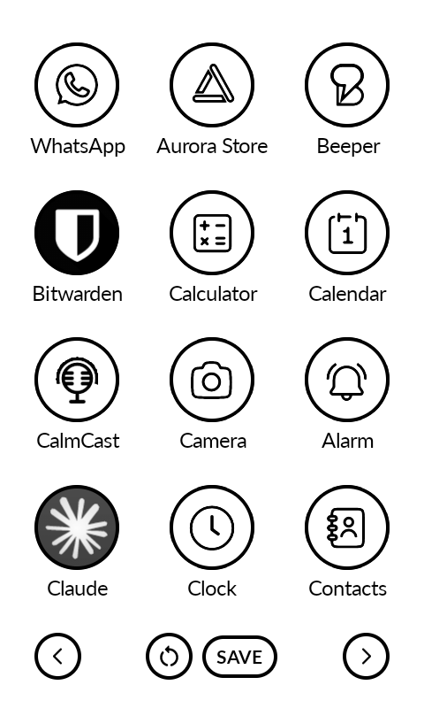</td>
            <td>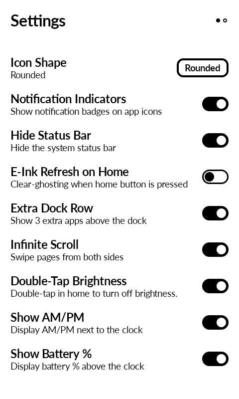</td>
        </tr>
    </table>

## Setup

- **Settings**: Long-press on any empty area of the home screen
- **Replace home apps**: Long-press on the Phone, SMS, or extra row shortcuts
- **Clock/Date shortcut**: Long-press on the clock or date to assign an app

## Features

- **3x4 app grid** tap on chevrons or use horizontal swipes
- **Music widget** with playback controls and song info, works with other third-party apps like Auxio, Fossify Music, Spotify, Foobar, CalmCast, Antenna Pod etc.
- **Icon tinting and shaping** for a uniform black & white look (works with ~95% of apps)
- **Icon shape**: Circle or Rounded, affects all icons, buttons, and indicators
- **Extra dock row**: 3 additional shortcuts above the Phone/SMS bar
- **Notification indicators** on app icons (requires notification listener permission)
- **Show battery %** with level-based icon above the clock.
- **Show AM/PM** for 12-hour clocks
- **Hide status bar** for a cleaner look
- **E-Ink refresh on home**: flashes the screen when pressing the home button to clear ghosting
- **Double-tap brightness**: toggle display brightness by double-tapping the home background (requires system settings permission)
- **Infinite scroll**: wrap around from last page to first
- **Simple wallpaper**: set a background image (not managed by Android)
- **Hide apps**: from the app context menu or bulk-hide from the home menu
- **Rename apps**: long-press any app in the grid
- **App context menu**: Reorder, Rename, Hide, App Info, Uninstall
- **Reorder apps**: swap-based reordering from the context menu, with reset to alphabetical option

## Permissions

| Permission | Why |
|------------|-----|
| `QUERY_ALL_PACKAGES` | List all installed apps |
| `WRITE_SETTINGS` | Double-tap brightness toggle |
| `REQUEST_DELETE_PACKAGES` | Uninstall apps from the context menu |
| `BIND_NOTIFICATION_LISTENER_SERVICE` | Read notifications for badge counts |
| `READ_CALL_LOG` | Missed call badge on Mudita Phone (Mudita Kompakt only) |
| `READ_SMS` | Unread SMS badge on Mudita Messages (Mudita Kompakt only) |

## FAQ

| Question | Answer |
|----------|--------|
| Will it have customizable fonts? | No. |
| Will it have a customizable grid? | No. |
| Will it have third-party icon packs? | No. |
| Will it get as many features as inkOS? | No. |
| Can I add more apps to the home screen? | No. |
| Can I adjust the opacity of the wallpaper? | No. |
| Can I change date/clock formats? | No. It follows Android settings. Change it there. |
| Can I add AM/PM to a 12-hour clock? | Yes. It's in the settings. |
| Can I reorder apps? | Yes. Long-press an app, tap Reorder, then tap another app to swap. Tap Save when done. |
| Will this launcher have a notification tray or letters screen? | No. |

## Troubleshooting

### Notification indicator not showing
Go to Settings > Notification Log and check if the notification exists in Android. Many apps require Google Play Services for push notifications. If it's not in the log, it doesn't exist for Android and Katapult can't read it.

### Notification not clearing
Check the Notification Log. If Android doesn't clear it, Katapult can't either.

### How to disable notification dots for a specific app
There are no allowlists. Go to Settings > App Notifications, tap the app, and disable "Allow notification dot".

## Support the project

<table><tr>
<td></td>
<td valign="middle">Katapult is free, open source, and ad-free forever. If it's made your phone better, consider supporting development.</td>
</tr></table>
